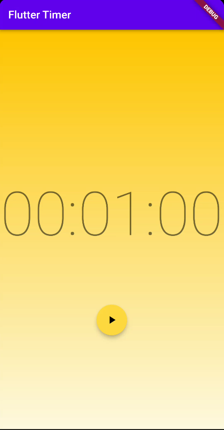

# timer

A flutter project that displays a timer with a sliding linear gradient background using BLoC

Full Minute             |  Almost halfway there|  Woot!
:-------------------------:|:-------------------------:|:-------------------------:
  |  |  
